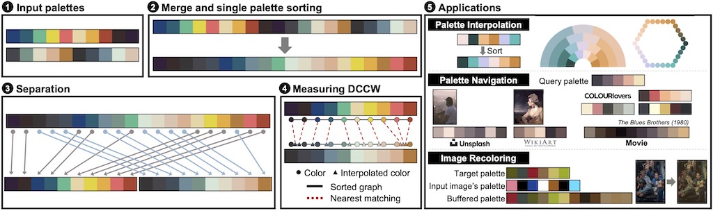
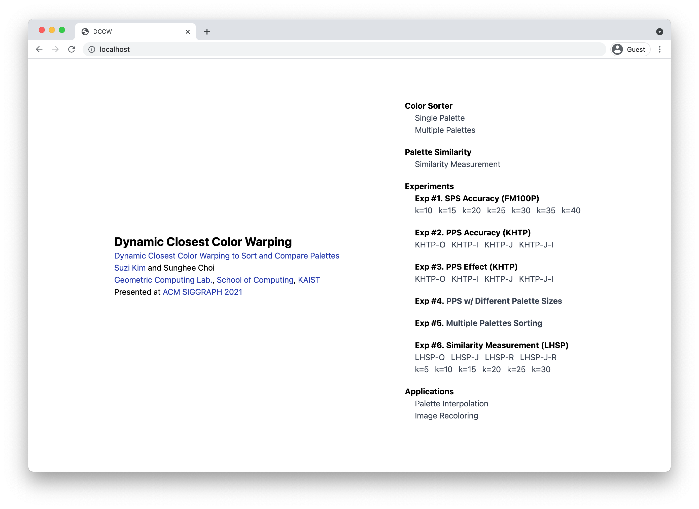
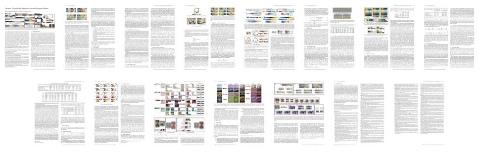

# Dynamic Closest Color Warping to Sort and Compare Palettes

  

[Dynamic Closest Color Warping to Sort and Compare Palettes](https://doi.org/10.1145/3450626.3459776)  
[Suzi Kim](https://kimsuzi.com/cv) and Sunghee Choi  
[Geometric Computing Lab.](https://gclab.kaist.ac.kr), [School of Computing](https://cs.kaist.ac.kr), [KAIST](https://kaist.ac.kr)  
Presented at [ACM SIGGRAPH 2021](https://s2021.siggraph.org/)

✨ This repo was given the [replicability stamp](http://www.replicabilitystamp.org/#https-github-com-suzikim-dccw) by the Graphics Replicability Stamp Initiative (GRSI).  

## Abstract 
A color palette is one of the simplest and most intuitive descriptors that can be extracted from images or videos. This paper proposes a method to assess the similarity between color palettes by sorting colors. While previous palette similarity measures compare only colors without considering the overall palette combination, we sort palettes to minimize the geometric distance between colors and align them to share a common color tendency. We propose dynamic closest color warping (DCCW) to calculate the minimum distance sum between colors and the graph connecting the colors in the other palette. We evaluate the proposed palette sorting and DCCW with several datasets and demonstrate that DCCW outperforms previous methods in terms of accuracy and computing time. We validate the effectiveness of the proposed sorting technique by conducting a perceptual study, which indicates a clear preference for the results of our approach. We also demonstrate useful applications enabled by DCCW, including palette interpolation, palette navigation, and image recoloring.   

## Demo
You can try demo here: https://suzikim.kaist.ac.kr

## How to Run

### Prerequisites 

Our code is executed on top of the [Docker](https://www.docker.com/) container. Please go to the [official docker installation guide](https://docs.docker.com/get-docker/) if you don't already have Docker installed on your system.

### Clone the Repository

```bash
git clone https://github.com/SuziKim/DCCW.git
cd DCCW 
```

### Downloade the Dataset
```bash
git clone https://github.com/SuziKim/DCCW-dataset.git experiments/DCCW-dataset
```


### Docker Setup
This repository provides a Dockerfile for setting up all dependencies. You can build and run a docker image by yourself.
```bash
mkdir user_data
docker-compose up --build
```

Now you can access ```localhost``` and see the DCCW website locally.


## Publication

Our paper is available at [ACM Digital Library](https://doi.org/10.1145/3450626.3459776).  


Following supplemental materials are also available. 
- [Supplemental material](files/SG2021-DCCW-Supplemental-Material-1.pdf) for acronym table, detailed related works, perceptual study analysis, and additional image recoloring results
- Perceptual study questionnaire for [SPS](files/SG2021-DCCW-perceptual_study-questionnaire-SPS.pdf) and [PPS](files/SG2021-DCCW-perceptual_study-questionnaire-PPS.pdf)

Please cite with the following Bibtex code:  

```bibtex
@article{kim2021dynamic,
    title = {Dynamic Closest Color Warping to Sort and Compare Palettes},
    author = {Kim, Suzi and Choi, Sunghee},
    year = {2021},
    journal = {ACM Transactions on Graphics (Proceedings SIGGRAPH)},
    volume = {40},
    number = {4},
    articleno = {95},
    pages  = {1--15},
    address = {New York, NY, USA},
    doi = {10.1145/3450626.3459776},
}
```

You may also want to refer to our publication with the more MLA style:  
*Kim, Suzi, and Sunghee Choi. "Dynamic Closest Color Warping to Sort and Compare Palettes." ACM Transactions on Graphics (TOG) 40.4 (2021)*


## Acknowledgements
This work was supported by [Institute of Information & communications Technology Planning & Evaluation (IITP)](https://www.iitp.kr/) grant funded by the Korea government(MSIT) (No.2019-0-01158, Development of a Framework for 3D Geometric Model Processing)

## Special Thanks
We've been inspired by many impressive color schemes uploaded on the Internet. We appreciate the designers who generate and share their incredible color schemes with us.
- [Colormind](http://colormind.io/)
- [COLOURLovers](https://www.colourlovers.com/)
- [Adobe Color](https://color.adobe.com/)
- [Coolors](https://coolors.co/)

## Contact

Contributions are always welcome! Don't heasitate to leave a question and issue on this [github repo](https://github.com/SuziKim/DCCW/issues). Alternatively, drop us an e-mail at <mailto:kimsuzi@kaist.ac.kr>.
